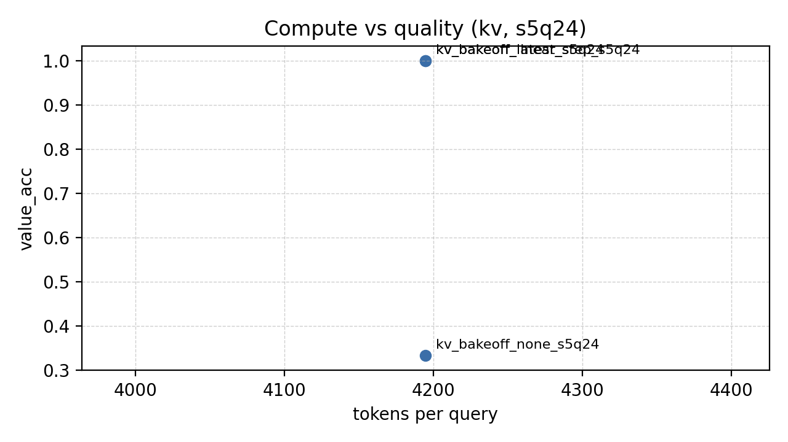

# GoldEvidenceBench

GoldEvidenceBench (CLI: `goldevidencebench`) is a benchmark + harness for long-context state tracking. It generates synthetic "episode logs" with evolving state (kv/kv_commentary/counter/set/relational), distractors (including instruction injection), and queries that require answering from the latest state update. It evaluates open-book vs closed-book protocols, enforces citation support IDs with capped-k + F1, checks entailment-from-citations, and uses counterfactual twin episodes to detect shortcut heuristics. It also reports efficiency (tokens/query, passes, wall time) so you can measure capability per compute.

GoldEvidenceBench is a small benchmark + reference codebase for testing whether an LLM can track evolving state across long documents by reading its own "book" artifacts:

- **Chapters**: narrative text (contains distractors and stale summaries)
- **Glossary (tags)**: a lightweight key reference
- **State ledger**: the authoritative state updates (with support IDs)

## TL;DR (layman summary)

GoldEvidenceBench shows whether your AI system can reliably pick the right piece of evidence when several similar candidates exist. It builds long, noisy logs with changing facts, then checks if the model chooses the most recent, correct update and cites it. The key benefit is that it separates "the evidence was available" from "the model chose the right evidence," so you can improve the exact part of your system that is failing (retrieval vs selection vs formatting).

This helps fix a common real-world failure: the right evidence is retrieved, but the model still picks the wrong snippet. GoldEvidenceBench isolates that selection bottleneck and shows when a simple selector/reranker fixes it.

Example (plain English):

Log:
- Update 1: "Shipping address = 12 Oak St"
- Update 2: "Shipping address = 99 Pine Ave"
- Note: "Customer mentioned they used to live on Oak St"

Question: "Where should we ship the order?"

Correct evidence is Update 2 (99 Pine Ave). The NOTE is contextual but not authoritative. GoldEvidenceBench measures whether the system chooses the correct update and cites it, even when nearby notes mention older facts.

## V2 takeaway (authority-aware selection)

In kv_commentary, the dominant failure is *authoritativeness*, not selection or reasoning. Adding `RETRIEVAL_AUTHORITY_FILTER=1` (drop NOTE lines before selection) restores perfect end-to-end accuracy across k and seeds. This is now the recommended default for kv_commentary.

## Primary flow (the done path)

1) Run one command to reproduce the headline:

```powershell
.\scripts\run_reference.ps1 -Preset standard -ModelPath "C:\AI\models\your-model.gguf"
```

2) Read the result table in `runs/summary_all.csv` (it matches the "Reference proof" section below).

3) Takeaways: selection under ambiguity fails for LLM?only; a deterministic selector fixes it; order bias disappears with selection.

Everything else in this README is an extension or deeper dive.

## Research use (reproducible runs)

Use this if you want publishable, comparable results:

- Freeze a preset (seeds/steps/queries/k/order/drop_prob) and name it in the paper.
- Run the canonical command once per model and keep the output under `runs/reference_v1/`.
- Report the decomposition line: `gold_present_rate -> selection_rate -> accuracy_when_gold_present -> overall accuracy`.
- Record the model path, commit hash, and command used with each run.

Suggested v1 reporting convention:

- Benchmark version: v1.0 (frozen presets + metrics)
- Model: <name/quant>
- Command: <exact command>
- Outputs: `runs/summary_all.csv`, plus the figure/table in the README

## Selector training (optional but powerful)

Train a tiny linear selector from generated data (no extra dependencies):

```powershell
python .\scripts\export_selector_dataset.py --data .\data\goldevidencebench.jsonl --out .\data\selector_train.jsonl --k 4 --wrong-type same_key --order shuffle
python .\scripts\train_selector_linear.py --data .\data\selector_train.jsonl --out .\models\linear_selector.json

$env:GOLDEVIDENCEBENCH_RETRIEVAL_RERANK="linear"
$env:GOLDEVIDENCEBENCH_RETRIEVAL_LINEAR_MODEL=".\models\linear_selector.json"
```

Use this when you want a learned selector instead of a fixed heuristic.
Authority-aware features used by the linear selector: UPDATE vs NOTE, step distance, position, and key/value overlap.
Authority filter baseline: set `GOLDEVIDENCEBENCH_RETRIEVAL_AUTHORITY_FILTER=1` to drop NOTE lines before selection.
Recommended default for kv_commentary: keep `RETRIEVAL_AUTHORITY_FILTER=1`.
Example training result (default settings): train_selection_rate 1.0000, test_selection_rate 1.0000.

Observed A/B (s3q16, same settings):

| mode | selection_rate | accuracy_when_gold_present | value_acc |
| --- | --- | --- | --- |
| LLM-only (none) | 0.3125 | 0.2292 | 0.2292 |
| linear selector | 0.5000 | 0.4375 | 0.4375 |

This shows a clear, tangible improvement from training the selector.
Re-run with higher seeds/queries for a more stable estimate.

Run a quick sweep with the trained selector:

```powershell
$env:GOLDEVIDENCEBENCH_RETRIEVAL_RERANK="linear"
$env:GOLDEVIDENCEBENCH_RETRIEVAL_LINEAR_MODEL=".\models\linear_selector.json"

$outDir = "runs\linear_selector_quick"
goldevidencebench sweep --out $outDir --seeds 1 --episodes 1 --steps 80 --queries 8 `
  --state-modes kv --distractor-profiles standard `
  --adapter goldevidencebench.adapters.retrieval_llama_cpp_adapter:create_adapter --no-derived-queries `
  --no-twins --require-citations --results-json "$outDir\combined.json" --max-book-tokens 400
python .\scripts\summarize_results.py --in "$outDir\combined.json" --out-json "$outDir\summary.json"
```

## Headline results (summary)

Selection under ambiguity is the bottleneck. Simple deterministic selection outperforms the LLM as candidate lists grow.

| Finding | Evidence |
| --- | --- |
| Ordering bias is severe | gold_last ? gold_middle/shuffle ? gold_first |
| Query sandwich did not help | selection_rate did not improve; shuffle got worse |
| Pick-then-answer did not help | selection_rate stayed flat or dropped |
| Deterministic reranker helps | rerank latest_step roughly doubles selection at k=2/4/8 |

## Reproduce the headline results (minimal commands)

1) Order bias (k=4, s3q16):

```powershell
$env:GOLDEVIDENCEBENCH_RETRIEVAL_K = "4"
$env:GOLDEVIDENCEBENCH_RETRIEVAL_ORDER_SEED = "0"
foreach ($order in @("gold_first","gold_middle","gold_last","shuffle")) {
  $env:GOLDEVIDENCEBENCH_RETRIEVAL_ORDER = $order
  $outDir = "runs\ambig_${order}_k4_s3q16"
  goldevidencebench sweep --out $outDir --seeds 3 --episodes 1 --steps 240 --queries 16 `
    --state-modes kv --distractor-profiles standard `
    --adapter goldevidencebench.adapters.retrieval_llama_cpp_adapter:create_adapter --no-derived-queries `
    --no-twins --require-citations --results-json "$outDir\combined.json" `
    --max-book-tokens 400 --distractor-rate 0.7 --clear-rate 0.01 --tail-distractor-steps 80
  python .\scripts\summarize_results.py --in "$outDir\combined.json" --out-json "$outDir\summary.json"
}
```

2) Reranker k-curve (same_key, shuffle, s5q24):

```powershell
$env:GOLDEVIDENCEBENCH_RETRIEVAL_WRONG_TYPE = "same_key"
$env:GOLDEVIDENCEBENCH_RETRIEVAL_ORDER = "shuffle"
$env:GOLDEVIDENCEBENCH_RETRIEVAL_ORDER_SEED = "0"
$ks = @("2","4","8")
foreach ($rerank in @("none","latest_step")) {
  $env:GOLDEVIDENCEBENCH_RETRIEVAL_RERANK = $rerank
  foreach ($k in $ks) {
    $env:GOLDEVIDENCEBENCH_RETRIEVAL_K = $k
    $outDir = "runs\ab_rerank_${rerank}_k${k}_same_shuffle_s5q24"
    goldevidencebench sweep --out $outDir --seeds 5 --episodes 1 --steps 200 --queries 24 `
      --state-modes kv --distractor-profiles standard `
      --adapter goldevidencebench.adapters.retrieval_llama_cpp_adapter:create_adapter --no-derived-queries `
      --no-twins --require-citations --results-json "$outDir\combined.json" `
      --max-book-tokens 400 --distractor-rate 0.7 --clear-rate 0.01 --tail-distractor-steps 80
    python .\scripts\summarize_results.py --in "$outDir\combined.json" --out-json "$outDir\summary.json"
  }
}
```

The benchmark generates synthetic episodes (updates + distractors + queries), including derived-invariant queries that require computation over the current state, grades model answers (optionally requiring citations/support IDs), and includes baselines (naive scan vs ledger-based reader).

## Defaults (chosen here)

These are the CLI defaults (picked to create long-ish documents with frequent distractors):

- `episodes=20`, `steps=220`, `keys=14`, `queries=12`, `derived_query_rate=0.35`, `chapters=8`, `twins=true`
- `distractor_rate=0.50`, `clear_rate=0.08`, `note_rate=0.12` (kv_commentary only)
- `distractor_profile=instruction` (adds spec-violating instructions); `instruction_suite` adds quoted/format variants; `adversarial` adds stale-echo distractors
- `state_mode=kv` (switch to `kv_commentary`, `counter`, `set`, or `relational`)
- `require_citations=true` (questions ask for JSON `{value, support_ids}` with max 3)
- Closed-book is the headline score (`goldevidencebench run` defaults to `--protocol closed_book`; open-book is diagnostic)

## Why this benchmark

This benchmark isolates a specific long-context failure mode: **state changes over time** (updates + clears), embedded in a long document with misleading restatements. It's motivated by reports that transformer LLMs can struggle with consistent state tracking across long sequences (see: MIT News, 2025-12-17).

## Attribution & method

This project uses AI-assisted coding and writing, with human review and iteration. The benchmark design, experiments, and results are reproducible; the goal is clarity and scientific usefulness over authorship style.

## Install

Python 3.12 is assumed.

```powershell
python -m pip install -e .
```

## Generate a dataset

Writes JSONL with one row per query.

```powershell
goldevidencebench generate --out .\data\goldevidencebench.jsonl --seed 0
```

Each row looks like:

- `id`: query ID
- `document`: the raw **episode log** (updates + distractors)
- `book`: a derived "book" artifact (chapters + glossary + ledger) for convenience/baselines
- `question`: the question text (and output format requirements if citations are enabled)
- `gold`: `{value, support_ids}` where `support_ids` contains the authoritative UPDATE ID that establishes the current value
- `meta`: includes `requires_citation`, the queried `key`, and derived-query fields
- `schema_version`: `"0.1"`
- `state_mode`: `kv|kv_commentary|counter|set|relational`

Derived queries add `meta.query_type=derived` with a `derived_op` and optional `derived_manager` (relational reports).

State dynamics:

- `kv` (default): standard key->value overwrites
- `kv_commentary`: like kv, but inserts non-authoritative NOTE ledger lines (latest_step can be wrong)
- `counter`: numeric accumulators (increments)
- `set`: membership add/remove (values are comma-separated lists)
- `relational`: reassignment tasks (e.g., who reports to whom)

## Run baselines

```powershell
goldevidencebench run --data .\data\goldevidencebench.jsonl --baseline naive
goldevidencebench run --data .\data\goldevidencebench.jsonl --baseline ledger
```

Protocols (headline = closed_book):

- `open_book`: baselines read the raw `document` (episode log)
- `closed_book`: baselines read only the derived `book` artifact

`goldevidencebench run` defaults to `--protocol closed_book` (pass `--protocol both` for diagnostics).

Metrics:

- `value_acc`: predicted `value` matches gold
- `cite_f1`: support-ID F1 (only when citations are required; capped at `max_support_k`)
- `support_bloat`: fraction of citation-required answers that use more support IDs than needed (penalized in exact accuracy)
- `entailment`: fraction where the answer is justified by the cited updates only
- `exact_acc`: value match + (if required) support includes gold + entailment-from-citations
- `twin_consistency`: counterfactual twin agreement/disagreement rate (anti-shortcut)
- `twin_flip_rate`: twin pairs where the answer flips when the decisive UPDATE flips (higher is better)
- `instr_acc` / `instr_gap`: accuracy on questions with instruction-injection distractors, and the drop vs. clean questions
- `instr_override_rate`: fraction of instruction-tagged questions that follow injected instructions (lower is better)
- `state_integrity_rate`: fraction of instruction-tagged questions that still answer from the latest true state (higher is better)
- Efficiency curve (printed by `goldevidencebench run`): tokens read, tokens/query, passes over doc, wall-clock seconds (`wall_s`) and per-query (`wall_s_per_q`). Llama-cpp runs also record `prefill_s`/`decode_s` and per-query variants when the low-level perf API is available.

## Quickstart evaluation

Use the PowerShell runner to avoid manual sweeps. It writes results to `runs\combined.json`.

Smoke check (fast, noisy signal):

```powershell
.\scripts\run_bench.ps1 -Preset smoke -ModelPath "C:\AI\models\your-model.gguf"
```

Standard check (still small, more stable):

```powershell
.\scripts\run_bench.ps1 -Preset standard -ModelPath "C:\AI\models\your-model.gguf"
```

By default the runner disables citations (value-only). To require citations, add `-RequireCitations`.
When citations are disabled, `exact_acc` tracks `value_acc`.

Summarize results into CSV/JSON (for papers/plots):

```powershell
python .\scripts\summarize_results.py --in .\runs\combined.json --out-csv .\runs\summary.csv --out-json .\runs\summary.json
```

Collect all run summaries into one CSV (optionally newest per pattern):

```powershell
python .\scripts\collect_runs.py --runs-dir .\runs --out-csv .\runs\summary_all.csv --latest-only
```

```powershell
python .\scripts\summarize_results.py --in .\runs\combined.json --out-csv .\runs\summary.csv --out-json .\runs\summary.json
```

The summary JSON includes overall means plus group means for `value_acc`, `exact_acc`, `cite_f1`, and `entailment`.
If `metrics_raw` are present, the summary includes `overall_raw` and `by_group_raw` for the same metrics.
Use `--out-decomp-csv` to emit a per-run decomposition table (gold_present_rate, selection_rate,
accuracy_when_gold_present, overall accuracy, plus retrieval settings).
Recency bucket summaries (tokens since last update, distractors since update, writes to key) are included when
`preds.jsonl` exists next to each `data.jsonl`. Defaults are `200,400,800,1600` for tokens, `2,4,8,16` for
distractors, and `1,2,4,8` for writes. You can override them:

```powershell
python .\scripts\summarize_results.py --in .\runs\combined.json --out-json .\runs\summary.json `
  --recency-buckets 200,400,800,1600 --distractor-buckets 2,4,8,16 --writes-buckets 1,2,4,8
```

To force longer recency gaps, add `--tail-distractor-steps N` when generating or sweeping. This makes the
final N steps distractor-only (no updates), creating a longer tail after the last update.

Speed: what actually dominates runtime

- Prefill usually dominates decode (long book/context). Cut prefill first: keep `--max-book-tokens` small while iterating.
- Use smoke/triage presets during development; save `standard` runs for headline tables.
- Total queries scale as `seeds x state_modes x distractor_profiles x episodes x queries` (twins doubles it).
- If selection is the bottleneck, add a selection-only mode that predicts support_id with minimal output; it can be much faster than full answers.

## Efficient testing workflow (fast -> slow)

Reference system (baseline vs reranker in one command):

```powershell
.\scripts\run_reference.ps1 -Preset quick -ModelPath "C:\AI\models\your-model.gguf"
```

Expected output: `runs\summary_all.csv` with rows for selector_quick_none_k2/4/8 and selector_quick_latest_step_k2/4/8.

```powershell
.\scripts\run_reference.ps1 -Preset quick -ModelPath "C:\AI\models\your-model.gguf"
```

Selector+answerer preset (reranker baseline):

```powershell
.\scripts\run_selector_bench.ps1 -Preset quick -ModelPath "C:\AI\models\your-model.gguf"
.\scripts\run_selector_bench.ps1 -Preset quick -ModelPath "C:\AI\models\your-model.gguf" -UseRerank
```

Selector bake-off (quick preset, four rerank modes):

```powershell
.\scripts\run_selector_bakeoff.ps1 -Preset quick -ModelPath "C:\AI\models\your-model.gguf"
```

Expected output: updated `runs\summary_all.csv` with selector_quick_<rerank>_k2/4/8 rows for `none`,
`latest_step`, `last_occurrence`, and `prefer_set_latest`.

Selector-only (fast selection metrics, skip LLM answers):

```powershell
.\scripts\run_selector_only.ps1 -Preset quick -ModelPath "C:\AI\models\your-model.gguf" -Rerank latest_step
```

Use this when tuning selector policies. It skips answer generation and only emits `support_ids`, so the relevant numbers are `gold_present_rate` and `selection_rate` (value accuracy is not meaningful in this mode).

Train a linear selector (no extra deps):

```powershell
python .\scripts\export_selector_dataset.py --data .\data\goldevidencebench.jsonl --out .\data\selector_train.jsonl --k 4 --wrong-type same_key --order shuffle
python .\scripts	rain_selector_linear.py --data .\data\selector_train.jsonl --out .\models\linear_selector.json

$env:GOLDEVIDENCEBENCH_RETRIEVAL_RERANK="linear"
$env:GOLDEVIDENCEBENCH_RETRIEVAL_LINEAR_MODEL=".\models\linear_selector.json"
```

The linear selector learns a small scoring function over candidate lines (step, position, op). Use `selection_rate` to compare against `none` or `latest_step`.

This is much faster because it emits only `support_ids`. Use `gold_present_rate` and `selection_rate` for analysis.

Estimate runtime before a sweep:

```powershell
python .\scripts\estimate_runtime.py --from-combined .\runs\combined.json --seeds 3 --episodes 1 --queries 12 --state-modes 2 --distractor-profiles 2 --twins
```

```powershell
python .\scripts\estimate_runtime.py --seeds 3 --episodes 1 --queries 12 --state-modes 2 --distractor-profiles 2 --twins --seconds-per-q 30
```

Why long sweeps take hours: total queries roughly equal
`seeds × state_modes × distractor_profiles × episodes × queries` (double if twins are on).
At ~40s/query, 144 queries is ~1h36m, 288 queries is ~3h12m.

Biggest speed lever: keep `--max-book-tokens` small during iteration (400-1200). Larger values
inflate prefill time unless you also raise model `n_ctx`.

Use these presets to iterate quickly:

Smoke (2-5 min): sanity check instruction handling.

```powershell
goldevidencebench sweep --out runs --seeds 1 --episodes 1 --steps 30 --queries 4 `
  --state-modes kv --distractor-profiles instruction `
  --adapter goldevidencebench.adapters.llama_cpp_adapter:create_adapter --no-derived-queries `
  --no-twins --no-require-citations --results-json .\runs\combined.json --max-book-tokens 600
```

Triage (10-20 min): compare kv vs set, standard vs instruction.

```powershell
goldevidencebench sweep --out runs --seeds 1 --episodes 1 --steps 60 --queries 8 `
  --state-modes kv,set --distractor-profiles standard,instruction `
  --adapter goldevidencebench.adapters.llama_cpp_adapter:create_adapter --no-derived-queries `
  --no-twins --no-require-citations --results-json .\runs\combined.json --max-book-tokens 1200
```

Real (hours): full run with citations + twins on for reporting.

```powershell
goldevidencebench sweep --out runs --seeds 3 --episodes 1 --steps 100 --queries 12 `
  --state-modes kv,set --distractor-profiles standard,instruction `
  --adapter goldevidencebench.adapters.llama_cpp_adapter:create_adapter --no-derived-queries `
  --results-json .\runs\combined.json --max-book-tokens 6000
```

PaTH-style curve (accuracy vs steps):

```powershell
goldevidencebench sweep --out runs --seeds 1 --episodes 1 --queries 8 `
  --steps-list 20,40,80,160,320 --state-modes kv --distractor-profiles standard `
  --adapter goldevidencebench.adapters.llama_cpp_adapter:create_adapter --no-derived-queries `
  --no-twins --no-require-citations --results-json .\runs\combined.json --max-book-tokens 600
```

Memory-budget curve (accuracy vs max_book_tokens):

```powershell
goldevidencebench sweep --out runs --seeds 1 --episodes 1 --steps 60 --queries 8 `
  --state-modes kv --distractor-profiles standard `
  --adapter goldevidencebench.adapters.llama_cpp_adapter:create_adapter --no-derived-queries `
  --no-twins --no-require-citations --results-json .\runs\combined.json `
  --max-book-tokens-list 200,400,800,1200
```

## Grade model outputs

Predictions JSONL can be either:

- `{ "id": "...", "value": "...", "support_ids": ["U0007"] }`, or
- `{ "id": "...", "output": "..." }` where `output` contains a JSON object (optionally embedded in text)

```powershell
goldevidencebench grade --data .\data\goldevidencebench.jsonl --pred .\preds.jsonl
```

## Plug in your model (adapter interface)

Implement a tiny adapter (module with `create_adapter()` returning an object that has `.predict(row, protocol="...") -> {"value": ..., "support_ids": [...]}`).

Reference adapter (wraps the ledger baseline): `goldevidencebench.adapters.ledger_adapter:create_adapter`.
Two-phase adapter example (build book once, answer many): `goldevidencebench.adapters.log_to_book_adapter:create_adapter` implements `build_artifact(document, episode_id, protocol)` then answers closed-book.
Closed-book Llama example (uses `llama-cpp-python`, set `GOLDEVIDENCEBENCH_MODEL` to a GGUF path): `goldevidencebench.adapters.llama_cpp_adapter:create_adapter`.
The Llama adapter extracts the `## State Ledger` section and keeps the most recent ledger tokens to fit context.
Streaming state-builder (chunked log -> compact ledger, then Llama answers): `goldevidencebench.adapters.streaming_llama_cpp_adapter:create_adapter`.
Set `GOLDEVIDENCEBENCH_STREAM_CHUNK_TOKENS` (default 512) to control chunk size. Set `GOLDEVIDENCEBENCH_STREAM_MODE=llm`
(default) to let the model extract updates per chunk, or `GOLDEVIDENCEBENCH_STREAM_MODE=parse` for a deterministic parser.
Teacher book-builder (LLM builds artifacts, answerer stays fixed): `goldevidencebench.adapters.llm_book_builder_adapter:create_adapter`.
Set `GOLDEVIDENCEBENCH_BUILDER_MODEL` to use a stronger model for artifact construction (defaults to `GOLDEVIDENCEBENCH_MODEL`).
Set `GOLDEVIDENCEBENCH_BUILDER_CHUNK_TOKENS` to control builder chunk size.
Set `GOLDEVIDENCEBENCH_BUILDER_MODE` to `heuristic`, `llm_fullscan` (default), or `llm_perkey`.
Set `GOLDEVIDENCEBENCH_BUILDER_PER_KEY_LLM=0` to disable per-key LLM calls (deterministic fallback).
Retrieval-first answerer (use only the latest ledger entry for the key): `goldevidencebench.adapters.retrieval_llama_cpp_adapter:create_adapter`.
Env var names use the `GOLDEVIDENCEBENCH_` prefix.
Set `GOLDEVIDENCEBENCH_RETRIEVAL_K` to include top-k latest entries for the key (default 1). Set
`GOLDEVIDENCEBENCH_RETRIEVAL_WRONG_TYPE` to `none`, `same_key`, or `other_key` to inject a wrong line for robustness
testing. Use `GOLDEVIDENCEBENCH_RETRIEVAL_INCLUDE_CLEAR=0` to skip CLEAR entries.
Use `GOLDEVIDENCEBENCH_RETRIEVAL_DROP_PROB` (0-1) to probabilistically drop the correct line, and
`GOLDEVIDENCEBENCH_RETRIEVAL_DROP_SEED` to make the drop deterministic by row id.
Use `GOLDEVIDENCEBENCH_RETRIEVAL_ORDER=shuffle|gold_first|gold_middle|gold_last` (and optional
`GOLDEVIDENCEBENCH_RETRIEVAL_ORDER_SEED`) to control ordering and test positional bias under ambiguity.
Set `GOLDEVIDENCEBENCH_RETRIEVAL_QUERY_SANDWICH=1` to repeat the question before and after the
candidate ledger lines (query sandwich mitigation).
Set `GOLDEVIDENCEBENCH_RETRIEVAL_PICK_THEN_ANSWER=1` to force a two-step flow: pick a support_id
first, then answer using only that line.
Set `GOLDEVIDENCEBENCH_RETRIEVAL_RERANK=latest_step|last_occurrence|prefer_set_latest|linear` to deterministically
choose a candidate before answering (non-LLM selector baseline). For `linear`, also set
`GOLDEVIDENCEBENCH_RETRIEVAL_LINEAR_MODEL` to the JSON model file from `train_selector_linear.py`.
Set `GOLDEVIDENCEBENCH_RETRIEVAL_SELECTOR_ONLY=1` to skip answer generation and emit only `support_ids`.
Use selection metrics (`gold_present_rate`, `selection_rate`) for speed-focused iterations; value accuracy is not meaningful
in selector-only mode.

Retrieval order bias (example, k=4, s3q16, kv/standard, gold always present):

- `gold_first`: value/exact/cite_f1 = 0.0
- `gold_middle`: value/exact/cite_f1 = 0.4167
- `shuffle`: value/exact/cite_f1 = 0.4583
- `gold_last`: value/exact/cite_f1 = 1.0

Entailment stays 1.0 and `gold_in_context_rate` is 1.0, so the failures are positional
selection errors (not retrieval or hallucination).

Order-bias (LLM-only, k=4, same_key, shuffle, s5q24):

| order | selection_rate | accuracy_when_gold_present | value_acc |
| --- | --- | --- | --- |
| gold_first | 0.0000 | 0.0000 | 0.0000 |
| gold_middle | 0.0083 | 0.0083 | 0.0083 |
| gold_last | 1.0000 | 1.0000 | 1.0000 |
| shuffle | 0.4417 | 0.4417 | 0.4417 |

Gold is always present; the collapse in gold_first/middle is pure selection bias.
This aligns with the smaller s3q16 run and shows the effect is stable with more samples.

Plot the order-bias figure:

```powershell
python .\scripts\plot_order_bias.py --in-csv .\runs\summary_all.csv --out .\docs\figures\order_bias_s5q24_llm.png
```


Order-bias (selector on: latest_step, same settings):

| order | selection_rate | accuracy_when_gold_present | value_acc |
| --- | --- | --- | --- |
| gold_first | 1.0000 | 0.9750 | 0.9750 |
| gold_middle | 1.0000 | 0.9750 | 0.9750 |
| gold_last | 1.0000 | 0.9750 | 0.9750 |
| shuffle | 1.0000 | 0.9750 | 0.9750 |

Selector removes order bias in this regime.

Plot the reranker k-curve:

```powershell
python .\scripts\plot_rerank_curve.py --in-csv .\runs\summary_all.csv --out .\docs\figures\rerank_k_curve_s5q24.png
```


Multi-model spot check (Meta-Llama-3.1-8B-Instruct Q4_K_M vs Qwen, s3q16):

| preset | model | selection_rate | accuracy_when_gold_present | value_acc |
| --- | --- | --- | --- | --- |
| hard selection (same_key, k=4, shuffle) | Qwen 2.5 7B | 0.4167 | 0.4167 | 0.4167 |
| hard selection (same_key, k=4, shuffle) | Meta-Llama 3.1 8B Q4_K_M | 0.3125 | 0.2708 | 0.2708 |
| order bias (gold_first) | Qwen 2.5 7B | 0.0000 | 0.0000 | 0.0000 |
| order bias (gold_first) | Meta-Llama 3.1 8B Q4_K_M | 0.0417 | 0.0417 | 0.0417 |
| order bias (gold_last) | Qwen 2.5 7B | 1.0000 | 1.0000 | 1.0000 |
| order bias (gold_last) | Meta-Llama 3.1 8B Q4_K_M | 0.5208 | 0.2917 | 0.2917 |

Meta-Llama shows the same order-bias pattern but lower selection under ambiguity in these runs.
Drop sweep (k=4, shuffle): Meta-Llama selection_rate falls from 0.2708 (drop=0) to 0.1875 (drop=0.2) and 0.0833 (drop=0.4).

Stability check (k=4, s5q24, kv/standard, gold always present):

- `gold_first`: value/exact/cite_f1 = 0.0
- `gold_middle`: value/exact/cite_f1 = 0.25
- `shuffle`: value/exact/cite_f1 = 0.2167
- `gold_last`: value/exact/cite_f1 = 1.0

Retrieval remains perfect (gold present in all contexts), so the ordering effect persists
with more samples.

Takeaway: with perfect retrieval and identical evidence, answer accuracy is dominated by
line ordering, exposing a strong positional bias in selection.

Drop-prob sweep (k=4, shuffle, s5q24):

- `drop_prob=0.0`: value/exact/cite_f1 = 0.5083, drop_rate = 0.0
- `drop_prob=0.2`: value/exact/cite_f1 = 0.4333, drop_rate = 0.1667
- `drop_prob=0.4`: value/exact/cite_f1 = 0.4333, drop_rate = 0.2917

Entailment stays 1.0; accuracy tracks evidence loss, and the curve flattens once
selection ambiguity dominates.

When retrieval stats and predictions are available, summary output also reports:

- `accuracy_when_gold_present`: value accuracy conditioned on the gold line being present.
- `selection_rate`: fraction of gold-present rows where the prediction cites the gold line.
- `decomposition_line`: `gold_present_rate -> selection_rate -> accuracy_when_gold_present -> overall accuracy`.

Query-sandwich A/B (same_key, k=4, s3q16):

- sandwich off: gold_first 0.0, gold_middle 0.0208, gold_last 0.5625, shuffle 0.4583
- sandwich on: gold_first 0.0, gold_middle 0.0, gold_last 0.5625, shuffle 0.1875

Selection rate tracks accuracy_when_gold_present in these runs; sandwich does not improve
selection under ambiguity and can make shuffle worse.

Pick-then-answer A/B (same_key, k=4, s3q16):

- pick off: gold_first 0.0, gold_middle 0.0, gold_last 0.5625, shuffle 0.2083
- pick on: gold_first 0.0, gold_middle 0.0208, gold_last 0.4167, shuffle 0.2083

Selection rate matches accuracy_when_gold_present; pick-then-answer does not improve
selection in this regime and can lower gold_last.

Matched s5q24 run (same_key, k=4, shuffle): pick-then-answer on/off are identical.
Both show selection_rate 1.0 and accuracy_when_gold_present 0.975, so the prompt trick adds no benefit in this easier regime.

Reranker baseline (same_key, k=4, shuffle, s3q16):

Selector failure mode (kv_commentary: NOTE lines are non-authoritative):

NOTE-aware rerank: set `GOLDEVIDENCEBENCH_RETRIEVAL_RERANK=prefer_update_latest` to ignore NOTE lines unless no UPDATE-style lines exist.

```powershell
$env:GOLDEVIDENCEBENCH_RETRIEVAL_RERANK = "latest_step"
$env:GOLDEVIDENCEBENCH_RETRIEVAL_K = "4"
goldevidencebench sweep --out runs --seeds 2 --episodes 1 --steps 120 --queries 8 `
  --state-modes kv_commentary --distractor-profiles standard `
  --adapter goldevidencebench.adapters.retrieval_llama_cpp_adapter:create_adapter --no-derived-queries `
  --no-twins --require-citations --results-json .\runs\combined.json --max-book-tokens 400 --note-rate 0.25
python .\scripts\summarize_results.py --in .\runs\combined.json --out-json .\runs\summary.json
```

Example outcome (kv_commentary, prefer_set_latest): value_acc 0.75, exact_acc 0.75, entailment 1.0. With naive latest_step in the same setting, value_acc was 0.25 and exact_acc 0.0, showing NOTE lines can break recency-based selectors and a simple policy fixes it.

KV commentary sanity check (from runs/summary_all.csv, matched A/B: same seeds + settings):

| preset | k | rerank | gold_present | selection_rate | value_acc | entailment |
| --- | --- | --- | --- | --- | --- | --- |
| custom | 4 | latest_step | 1 | 1.0 | 0.75 | 0.75 |
| custom | 4 | prefer_set_latest | 1 | 0.75 | 0.75 | 1.0 |

Matched A/B shows `latest_step` maximizes selection but can cite non-authoritative NOTE lines (entailment drops), while `prefer_set_latest` preserves entailment.

KV commentary selector A/B (s3q16, k=4, same_key, shuffle):

| preset | k | rerank | gold_present | selection_rate | accuracy_when_gold_present | value_acc | entailment |
| --- | --- | --- | --- | --- | --- | --- | --- |
| custom | 4 | latest_step | 1.0 | 1.0 | 0.7292 | 0.7292 | 0.8542 |
| custom | 4 | prefer_set_latest | 1.0 | 0.7292 | 1.0 | 1.0 | 1.0 |
| custom | 4 | prefer_update_latest | 1.0 | 0.7292 | 1.0 | 1.0 | 1.0 |
| custom | 4 | linear | 1.0 | 1.0 | 0.7292 | 0.7292 | 0.8542 |

In kv_commentary, `prefer_set_latest` and `prefer_update_latest` keep end-to-end accuracy/entailment perfect even though selection_rate is lower, while the linear selector always chooses the gold line but still produces incorrect answers in ~27% of cases. This suggests the linear model is not robust to NOTE-line noise yet.

KV commentary selector bake-off (s5q24, k=4, same_key, shuffle):

| preset | k | rerank | gold_present | selection_rate | accuracy_when_gold_present | value_acc | entailment |
| --- | --- | --- | --- | --- | --- | --- | --- |
| custom | 4 | prefer_set_latest | 1.0 | 0.5833 | 1.0 | 1.0 | 1.0 |
| custom | 4 | prefer_update_latest | 1.0 | 0.5833 | 1.0 | 1.0 | 1.0 |
| custom | 4 | linear | 1.0 | 0.9833 | 0.5667 | 0.5667 | 0.7250 |

KV commentary grid (s3q16, same_key, k in {2,4,8}):

| rerank | k | selection_rate | accuracy_when_gold_present | value_acc | entailment |
| --- | --- | --- | --- | --- | --- |
| prefer_set_latest | 2 | 0.7500 | 0.9792 | 0.9792 | 1.0000 |
| prefer_set_latest | 4 | 0.7292 | 1.0000 | 1.0000 | 1.0000 |
| prefer_set_latest | 8 | 0.7292 | 1.0000 | 1.0000 | 1.0000 |
| linear | 2 | 1.0000 | 0.7292 | 0.7292 | 0.8542 |
| linear | 4 | 1.0000 | 0.7292 | 0.7292 | 0.8542 |
| linear | 8 | 1.0000 | 0.7292 | 0.7292 | 0.8542 |

The learned selector still fails on NOTE authoritativeness across k, while prefer_set_latest stays perfect end-to-end.

Authority filter baseline (RETRIEVAL_AUTHORITY_FILTER=1, linear rerank, s3q16):

| k | selection_rate | accuracy_when_gold_present | value_acc | entailment |
| --- | --- | --- | --- | --- |
| 2 | 1.0000 | 1.0000 | 1.0000 | 1.0000 |
| 4 | 1.0000 | 1.0000 | 1.0000 | 1.0000 |
| 8 | 1.0000 | 1.0000 | 1.0000 | 1.0000 |

Authority filter stability (s5q24):

| k | selection_rate | accuracy_when_gold_present | value_acc | entailment |
| --- | --- | --- | --- | --- |
| 2 | 1.0000 | 1.0000 | 1.0000 | 1.0000 |
| 4 | 1.0000 | 1.0000 | 1.0000 | 1.0000 |
| 8 | 1.0000 | 1.0000 | 1.0000 | 1.0000 |

With authority filtering, the selector becomes fully NOTE-robust across k.

| preset | k | rerank | gold_present | selection_rate | accuracy_when_gold_present | value_acc | entailment |
| --- | --- | --- | --- | --- | --- | --- | --- |
| custom | 4 | prefer_set_latest | 1.0 | 0.5833 | 1.0 | 1.0 | 1.0 |
| custom | 4 | prefer_update_latest | 1.0 | 0.5833 | 1.0 | 1.0 | 1.0 |
| custom | 4 | linear | 1.0 | 0.9833 | 0.5667 | 0.5667 | 0.7250 |

At s5q24, NOTE-aware deterministic policies remain perfect end-to-end, while the linear selector still loses accuracy and entailment despite near-perfect selection.

KV selector bake-off (s5q24, k=4, same_key, shuffle):

| rerank | gold_present | selection_rate | accuracy_when_gold_present | value_acc | entailment |
| --- | --- | --- | --- | --- | --- |
| none | 1.0 | 0.3583 | 0.3583 | 0.3583 | 0.9917 |
| latest_step | 1.0 | 1.0 | 0.9750 | 0.9750 | 0.9750 |
| prefer_set_latest | 1.0 | 1.0 | 0.9750 | 0.9750 | 0.9750 |
| linear | 1.0 | 1.0 | 0.9750 | 0.9750 | 0.9750 |



Multi-model check (kv, latest_step, s5q24):

| model | gold_present | selection_rate | accuracy_when_gold_present | value_acc | entailment |
| --- | --- | --- | --- | --- | --- |
| Qwen2.5-7B Q5_K_M | 1.0 | 1.0 | 0.9750 | 0.9750 | 0.9750 |
| Llama-3.1-8B Q4_K_M | 1.0 | 1.0 | 0.8083 | 0.8083 | 0.8083 |

Even with identical retrieval/selection, model quality still matters for answer extraction; Qwen outperforms Llama here.


Linear selector order generalization (kv_commentary, k=4, s5q24):

| order | selection_rate | accuracy_when_gold_present | value_acc | entailment |
| --- | --- | --- | --- | --- |
| gold_first | 0.9833 | 0.5667 | 0.5667 | 0.7250 |
| gold_middle | 0.9833 | 0.5667 | 0.5667 | 0.7250 |
| gold_last | 0.9750 | 0.5583 | 0.5583 | 0.7167 |
| shuffle | 0.9750 | 0.5583 | 0.5583 | 0.7167 |

Order effects are mostly eliminated, but NOTE authoritativeness still breaks end-to-end accuracy.


In this mode, NOTE lines appear after real updates, so `latest_step` can fail while `prefer_set_latest` holds.

Order-bias check with NOTE-aware rerank (kv_commentary, k=4, s3q16):

| order | selection_rate | accuracy_when_gold_present | value_acc | entailment |
| --- | --- | --- | --- | --- |
| gold_first | 0.7292 | 1.0 | 1.0 | 1.0 |
| gold_middle | 0.7292 | 1.0 | 1.0 | 1.0 |
| gold_last | 0.7292 | 1.0 | 1.0 | 1.0 |
| shuffle | 0.7292 | 1.0 | 1.0 | 1.0 |

With `prefer_update_latest`, order bias disappears in kv_commentary while end-to-end accuracy stays perfect.


- rerank none: accuracy_when_gold_present 0.3333, selection_rate 0.3333
- rerank latest_step: accuracy_when_gold_present 0.625, selection_rate 0.625

A simple deterministic selector can outperform the LLM under ambiguity.

Reranker k-curve (same_key, shuffle, s3q16), accuracy_when_gold_present:

- k=1: rerank none 0.50, rerank latest_step 0.4375
- k=2: rerank none 0.3958, rerank latest_step 0.625
- k=4: rerank none 0.25, rerank latest_step 0.4375
- k=8: rerank none 0.2083, rerank latest_step 0.6875

Deterministic reranking dominates as k grows, highlighting selection as the bottleneck.

Reranker k-curve (same_key, shuffle, s5q24), accuracy_when_gold_present:

Selector quick preset (same_key, shuffle, s2q12):

- no rerank: k=2 0.5417, k=4 0.3333, k=8 0.2917
- rerank latest_step: k=2 1.0, k=4 1.0, k=8 1.0

Quick preset takeaway: even a small reranker makes selection near-perfect in fast runs.

## One command reproduces the headline

Run one script, get one CSV, and compare the table below:

```powershell
.\scripts\run_reference.ps1 -Preset standard -ModelPath "C:\AI\models\your-model.gguf"
```

This writes `runs\summary_all.csv`. The "Report preset (s5q24)" table below is a direct copy of those rows.

Headline takeaways:

- Selection degrades as k grows when using LLM-only selection.
- Deterministic reranking (latest_step/prefer_set_latest) restores near-perfect selection when gold is present.
- Naive positional heuristics (last_occurrence) fail under shuffle, showing order bias is real.

## Reference proof (selector vs LLM)

latest_step reranking uses only fields present in the candidate ledger lines (no hidden gold metadata).

| preset | k | rerank | gold_present | selection_rate | value_acc |
| --- | --- | --- | --- | --- | --- |
| quick | 2 | none | 1 | 0.1667 | 0.1667 |
| quick | 4 | none | 1 | 0.2917 | 0.2917 |
| quick | 8 | none | 1 | 0.25 | 0.25 |
| quick | 2 | latest_step | 1 | 1 | 1 |
| quick | 4 | latest_step | 1 | 1 | 1 |
| quick | 8 | latest_step | 1 | 1 | 1 |


Report preset (s5q24) run (same table, larger sample):

| preset | k | rerank | gold_present | selection_rate | value_acc |
| --- | --- | --- | --- | --- | --- |
| standard | 2 | none | 1 | 0.55 | 0.55 |
| standard | 4 | none | 1 | 0.3333 | 0.3333 |
| standard | 8 | none | 1 | 0.2583 | 0.2583 |
| standard | 2 | latest_step | 1 | 1 | 0.9667 |
| standard | 4 | latest_step | 1 | 1 | 0.9667 |
| standard | 8 | latest_step | 1 | 1 | 0.9667 |
| standard | 2 | last_occurrence | 1 | 0.2917 | 0.2917 |
| standard | 4 | last_occurrence | 1 | 0.125 | 0.1083 |
| standard | 8 | last_occurrence | 1 | 0.1083 | 0.1083 |
| standard | 2 | prefer_set_latest | 1 | 1 | 0.9667 |
| standard | 4 | prefer_set_latest | 1 | 1 | 0.9667 |
| standard | 8 | prefer_set_latest | 1 | 1 | 0.9667 |

Interpretation: selection under ambiguity is the bottleneck. The LLM-only selector degrades as k grows, while simple deterministic reranking (latest_step or prefer_set_latest) restores near-perfect selection when gold is present. last_occurrence underperforms because shuffled candidates break recency-by-position.

```powershell
.\scripts\run_selector_bench.ps1 -Preset standard -ModelPath "C:\AI\models\your-model.gguf"
.\scripts\run_selector_bench.ps1 -Preset standard -ModelPath "C:\AI\models\your-model.gguf" -UseRerank
```

```powershell
.\scripts\run_selector_bench.ps1 -Preset standard -ModelPath "C:\AI\models\your-model.gguf"
.\scripts\run_selector_bench.ps1 -Preset standard -ModelPath "C:\AI\models\your-model.gguf" -UseRerank
```


- k=2: rerank none 0.3167, rerank latest_step 0.6667
- k=4: rerank none 0.1667, rerank latest_step 0.6250
- k=8: rerank none 0.1583, rerank latest_step 0.4167

Decomposition line per run is `gold_present_rate -> selection_rate -> accuracy_when_gold_present -> overall accuracy`.

Formulas people can use:

- `gold_present_rate` = fraction of rows where the gold line is in context.
- `selection_rate` = fraction of gold-present rows that cite the gold line.
- `accuracy_when_gold_present` = accuracy conditioned on gold-present rows.
- `overall_accuracy` = `gold_present_rate * accuracy_when_gold_present`.
- `selection_gap` = `accuracy_when_gold_present - overall_accuracy` (loss from selection + formatting).

Blunt system rule: if `gold_present_rate` is high but `selection_rate` is low, fix selection/ranking. If `gold_present_rate` is low, fix retrieval/recall. If both are high but accuracy is low, fix answer formatting or value extraction.

How to read the scores (plain English):

- If `gold_present_rate` is low, your retriever is failing (evidence missing).
- If `gold_present_rate` is high but `selection_rate` is low, you have an ordering/selection problem.
- If `selection_rate` is high but `accuracy_when_gold_present` is low, the answerer fails even with correct evidence.
- If `value_acc` is high but `exact_acc` is low, answers are right but citations/formatting are wrong.

Reproduce the k=4 order-bias run:

```powershell
$env:GOLDEVIDENCEBENCH_RETRIEVAL_K = "4"
$env:GOLDEVIDENCEBENCH_RETRIEVAL_ORDER_SEED = "0"
foreach ($order in @("gold_first","gold_middle","gold_last","shuffle")) {
  $env:GOLDEVIDENCEBENCH_RETRIEVAL_ORDER = $order
  $outDir = "runs\ambig_${order}_k4_s3q16"
  goldevidencebench sweep --out $outDir --seeds 3 --episodes 1 --steps 240 --queries 16 `
    --state-modes kv --distractor-profiles standard `
    --adapter goldevidencebench.adapters.retrieval_llama_cpp_adapter:create_adapter --no-derived-queries `
    --no-twins --require-citations --results-json "$outDir\combined.json" `
    --max-book-tokens 400 --distractor-rate 0.7 --clear-rate 0.01 --tail-distractor-steps 80
  python .\scripts\summarize_results.py --in "$outDir\combined.json" --out-json "$outDir\summary.json"
}
```

Query-sandwich variant (toggle only; same run otherwise):

```powershell
$env:GOLDEVIDENCEBENCH_RETRIEVAL_QUERY_SANDWICH = "1"
goldevidencebench sweep --out runs --seeds 1 --episodes 1 --steps 120 --queries 8 `
  --state-modes kv --distractor-profiles standard `
  --adapter goldevidencebench.adapters.retrieval_llama_cpp_adapter:create_adapter --no-derived-queries `
  --no-twins --require-citations --results-json .\runs\combined.json --max-book-tokens 400
```

Adapter contract (hard-validated):

- `value` required.
- `support_ids` must be a list (max 3 by default) and must reference UPDATE IDs in the episode (closed-book uses the book ledger).
- Extra fields are rejected; missing `value` fails fast.
- `adapter_schema_version=1.0` is attached to metrics outputs for compatibility.

Run your adapter:

```powershell
goldevidencebench model --data .\data\goldevidencebench.jsonl --adapter goldevidencebench.adapters.ledger_adapter:create_adapter --protocol closed_book
```

Adapter tuning:

- `goldevidencebench model --max-book-tokens 1200` (passed to adapters that expose `max_book_tokens`).
- Llama adapter logs prompt token counts to stderr for debugging.
- For the llama-cpp adapter, set `GOLDEVIDENCEBENCH_REQUIRE_CITATIONS=0` to force `support_ids` to be an empty list (value-only mode).
- Llama-cpp adapter uses grammar-constrained decoding when available: citations-on runs force exactly one support ID, citations-off runs force an empty list.
- When citations are required, the adapter deterministically selects the latest ledger ID for the tag that matches the predicted value, falling back to the latest ledger entry for the tag.

Both `goldevidencebench run` and `goldevidencebench model` can emit machine-readable metrics via `--results-json` (JSON object or array; overwrites the file each run; intended for plotting accuracy vs tokens/passes). Closed-book with `--protocol both` writes an array.

Practical runs: create a folder per run, sweep multiple seeds/state_modes/distractor_profiles, and keep one `results.json` per run to compare stability (long-context behavior is seed/ordering-sensitive).

Sweeps: `goldevidencebench sweep --out runs --seeds 5 --state-modes kv,counter,set,relational --distractor-profiles standard,adversarial,instruction` (writes one subfolder per combo with data/preds/results).
Use `--no-require-citations` in sweeps to disable citations in generated data and grading.

## Anti-cheat / robustness notes

- The episode log contains **UPDATE** lines (authoritative) and **DISTRACTOR** lines (untrusted).
- When citations are enabled, correct answers require returning **support IDs** (update IDs like `U0007`) and passing **entailment-from-citations**.
- By default, every episode also includes a **counterfactual twin** (one UPDATE is flipped); grading reports `twin_consistency` to detect shortcut heuristics.
- UPDATE IDs are non-monotonic (hash-like) to prevent "pick the max ID" shortcuts; ordering comes from the logged `step`.
- Closed-book protocol feeds only the derived book artifact (no episode log).
- Book artifacts are structurally validated (allowed sections + ledger grammar) to prevent hidden log leaks.
- `--distractor-profile instruction` (default) injects spec-violating instructions plus format traps (invalid JSON/extra fields); `adversarial` adds stale-echo distractors (late repeats of old values).
- Instruction profiles also insert "helpful summary" restatements of stale values.
- Instruction-injection resistance is measured via `instr_acc`/`instr_gap`; answers derived from instruction lines are not authoritative.

### Efficiency snapshot (ledger baseline, 1 episode, steps=150, queries=12, distractor_profile=instruction)

Closed-book (headline metric):

| state_mode | exact_acc | tokens/query |
| --- | --- | --- |
| kv | 1.00 | 3,574 |
| counter | 1.00 | 3,537 |
| set | 1.00 | 3,601 |
| relational | 1.00 | 3,473 |

Open-book (diagnostic):

| state_mode | exact_acc | tokens/query |
| --- | --- | --- |
| kv | 1.00 | 1,922 |
| counter | 1.00 | 1,910 |
| set | 1.00 | 1,955 |
| relational | 1.00 | 1,879 |

## Dev

```powershell
python -m pip install -e .[dev]
python -m pytest
python -m ruff check .
```
What's new: GoldEvidenceBench now evaluates closed-book state tracking by default (answer using only a derived "book" artifact, not the raw episode log), adds richer state dynamics (kv|kv_commentary|counter|set|relational) and derived-invariant queries, and includes adversarial distractors such as instruction injection, format traps, and stale-echo repeats of outdated values. To reduce loopholes, UPDATE IDs are non-monotonic (hash-like) and each episode includes a counterfactual twin; grading reports both twin_consistency and twin_flip_rate alongside support_bloat. `goldevidencebench run` also prints an efficiency curve (tokens read, tokens/query, passes, wall-clock) so accuracy can be compared against compute cost.


## Related work (links)

### Long-context + positional sensitivity
- Lost in the Middle (position bias in long contexts): https://arxiv.org/abs/2307.03172
- StreamingLLM / ?Attention Sinks? (long-context behavior + streaming tricks): https://arxiv.org/abs/2309.17453
- LongBench (long-context evaluation suite): https://arxiv.org/abs/2308.14508
- RULER (stress tests for long-context retrieval/selection): https://arxiv.org/abs/2404.06654
- L-Eval (long-context evaluation): https://arxiv.org/abs/2307.11088
- LooGLE (long dependency benchmark): https://arxiv.org/abs/2311.04939
  - LooGLE v2 (newer version): https://arxiv.org/abs/2510.22548
- ?Context length alone hurts reasoning? (relevant to ?gold present but still fails?): https://arxiv.org/abs/2510.05381

### State tracking / long-text motivation (what kicked this off)
- MIT News: PaTH Attention (state tracking / long text): https://news.mit.edu/2025/new-way-to-increase-large-language-model-capabilities-1217

### RAG evaluation toolkits (end-to-end pipelines)
- RAGAS: https://github.com/explodinggradients/ragas
- TruLens: https://www.trulens.org/
- LangSmith evals (practical eval workflows): https://docs.langchain.com/langsmith/evaluation-quickstart
- OpenAI Evals (general eval harness): https://github.com/openai/evals

### Grounded generation + citations / attribution
- KILT (knowledge-intensive tasks + provenance): https://arxiv.org/abs/2009.02252
- ALCE (Attributed LLMs / citation benchmark): https://arxiv.org/abs/2305.14627
- SelfCite (improving citation quality via context ablation): https://arxiv.org/abs/2502.09604
- FRONT (fine-grained grounded citations on ALCE): https://arxiv.org/abs/2408.04568
